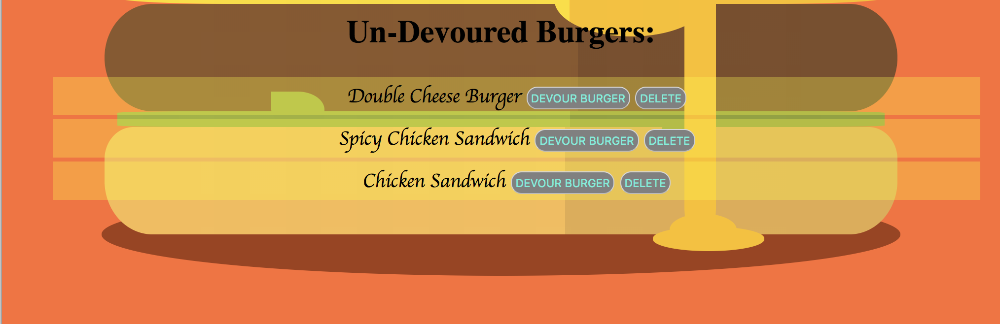

# Assignment: Burger-Mania


## Summary:
Burger-Mania, a burger-themed application that renders the situational case where the user could: 1) Choose a burger from an already pre-set choice of 6 burgers I created as samples and 2) Personally add a burger of their choice and have it  added to the ‘burgers’ table database, just like ordering your burger/food through an online application we are used to seeing these days! Burger-Mania was created using basic javascript on node and express, with a SQL database. Express handlebars was also used. Burger-Mania, will allow the user to “devour” (aka “eat”) or “un-devour” the list of displayed burgers by clicking either of the two buttons. Similar to the likely scenario of actually eating a burger, “Burger-Mania” would update the status of the burger being eaten or not by dynamically changing it’s values between the burgers table. The burgers table, located within the “burgers_db” SQL database, will allow the user to view the burgers devoured/eaten within in the top  table displayed within the top webpage, and “un-devoured burgers” list displayed just below the “devoured”.  Once a burger is devoured, just like throwing away your trash of the meal, the user will be able to click on the delete button whenever they plan on removing any burgers from the list whenever they want. Under the "Add a Burger" portion, the user could uniquely add a burger of their choice by entering the name of the new burger or simply reorder a deleted burger from the list by pressing the submit button below the form would dynamically add the burger to list...

Simply put, Burger-Mania will allow users to (in no specific order):


1) Submit a personal burger to the app
2) Eat a burger within the app
3) Re-order a previously deleted burger
4) Delete a burger from the list provided
 


## Getting Started:
The simpliest way in seeing a demo of Burger Mania is to click on the Heroku link (https://hidden-mountain-42182.herokuapp.com/) that leads it directly to the project without any installations required. This link can be found within this readme file or at the description area within http://github.com/duongsters/burger

To connect locally...
1) Clone burger repository via https://github.com/duongsters/burger
2) Run command line Terminal (or via Gitbash) 'npm install' for required NPMS used within the application
3) Run command line 'node server.js' to start up the application
4) Once connected to http://localhost:8080/ from CLI, copy that exact link to URL
5) Run 'ctrl + c' within the CLI to exit the application entirely

## Technologies Used:
- NPM: I used specifically the Express-Handlebars, mySQL, Express throughout the entire assigment.
- Node.JS: Basically the engine that runs the NPM packages used as stated above.
- Javascript: Basically used within the main files to render the entire application


## Code Snippet(s)
via burgers_controller.js:
* This specific of code within my burgers_controller.js file shows 2 functions ...the top functions runs to add a burger to the list and the router.delete function below routes the function in deleting a burger from the burgers table
```javascript
router.put("/api/burgers/:id", function (req, res) {
    var condition = "id = " + req.params.id;
    console.log("condition", condition);
console.log(condition);
    burger.updateOne({
        devoured: req.body.devoured
    },
        condition, function (result) {
            if (result.changedRows == 0) {
                return res.status(404).end();
            }
            else {
                res.status(200).end();
            }
        });
});

//.delete express call method in deleting a burger from the db
router.delete("/api/burgers/:id", function (req, res) {
    var condition = "id = " + req.params.id;

    burger.delete(condition, function (result) {
        if (result.affectedRows == 0) {
            return res.status(404).end();
        }
        else {
            res.status(200).end();
        }
    });
});

```


via orm.js :
* This specific portion within my orm.js file will be running as the CRUD (Creating, Reading, Updating and Deleteing a burger) for the application
```javascript
var orm = {

    selectAll: function (tableInput, cb) {
        var queryString = "SELECT * FROM " + tableInput + ";";
        connection.query(queryString, function (err, result) {
            if (err) {
                throw err;
            }
            cb(result);
        });
    },

    insertOne: function (table, cols, vals, cb) {
        var queryString = "INSERT INTO " + table;

        queryString += " (";
        queryString += cols.toString();
        queryString += ") ";
        queryString += "VALUES (";
        queryString += printQuestionMarks(vals.length);
        queryString += ") ";

        console.log(queryString);

        connection.query(queryString, vals, function (err, result) {
            if (err) {
                throw err;
            }
            cb(result);
        });

    },


    updateOne: function(table, objColVals, condition, cb) {
        var queryString = "UPDATE " + table;

        queryString += " SET ";
        queryString += objToSql(objColVals);
        queryString += " WHERE ";
        queryString += condition;

        console.log(queryString);
        connection.query(queryString, function(err, result){
            if (err) {
                throw err;
            }
            cb(result);
        });

    },


    delete: function (table, condition, cb) {
        var queryString = "DELETE FROM " + table;
        queryString += " WHERE ";
        queryString += condition;

        connection.query(queryString, function (err, result) {
            if (err) {
                throw err;
            }
            cb(result);
        });
    }
};

```


## Author Links:
[GitHub](https://github.com/duongsters)
[LinkIn](https://www.linkedin.com/in/theandrewduong/)